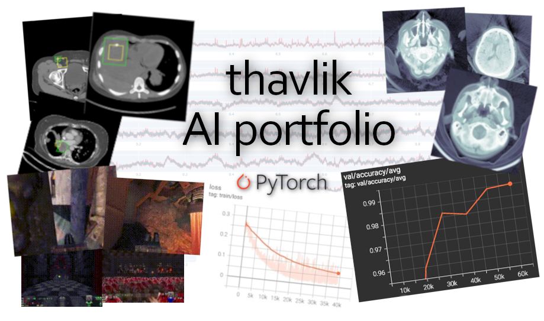

# Thomas Havlik's Medical AI Portfolio
[](https://github.com/thavlik/machine-learning-portfolio)
[](./LICENSE-Apache)
[](./LICENSE-MIT)
[](https://www.python.org/)

I am deep learning researcher that is applying for the 2024 medical school admission cycle. It seems beneficial to offer concrete examples of how I work with medical data. These projects are enumerated here, and each has its own page that details the challenges faced and the results achieved.

For obvious reasons, none of my professional medical AI work is featured here.

## Experiments
These experiments make use of ground truth provided with the data. Ground truth for medical data typically constitutes either empirical measurement or the judgment of attending physicians.

After spending over $3,000 of my wages running these experiments, I believe additional progress can be made anywhere. However, my limited budget necessitates that only the most promising experiments see a GPU.

Research is convoluted (pun intended); large amounts of time and effort are often necessary to observe any results at all - even bad results. Additional work is then invested out of faith in one's techniques, frequently to no avail. When this happens, it seems to me the appropriate course of action is to humbly publish one's theoretical and empirical findings, so that others may benefit. Even though the structure of medical data is highly amenable to deep learning, it is important not to underestimate the difficulty of achieving performance on par with physicians.

### Completed projects
This is a list of tasks that I have "solved", meaning that I've trained a model capable of performing the task with respectable accuracy.
- [RSNA Intracranial Hemorrhage Prediction](experiments/rsna-intracranial/README.md): classification of brain CT scans by hemorrhage type
- [DeepLesion](experiments/deeplesion/README.md): localization of tumors on abdominal CT scans
- [Grasp-and-Lift EEG Detection](experiments/grasp_and_lift_eeg/README.md): fine-grain detection of motor activity using EEG

### Works in progress
These are tasks that I haven't solved yet, mostly because training on fMRI scans is nontrivial and requires way more video memory than I have at my disposal. As the potential for machine interpretation of fMRI data is enormous, I am determined to deliver on a project with this modality.
- [StudyForrest](experiments/forrestgump/README.md) (WIP): infer features of an audio-only film with fMRI
- [LA5c Study](experiments/la5c/README.md) (WIP): predict participants' questionnaire answers from their MRI scans
- [Neural Rendering](experiments/graphics/README.md) (WIP): single-shot, differentiable 3D rendering

## Datasets
These are datasets that I have compiled. My interest in the modeling of visual manifolds was first inspired by [recurrent dreams of mine that assume the form of video games](https://en.wikipedia.org/wiki/Tetris_effect), particularly those from my childhood. I have always found such media of dreaming to be both visually intuitive and semantically potent - attributes critical for unsupervised learning. 

- [Doom Gameplay Dataset](https://github.com/thavlik/doom-gameplay-dataset): 170+ hours of unlabeled Doom 1/2 gameplay
- [Quake Gameplay Dataset](https://github.com/thavlik/quake-gameplay-dataset): 200+ hours of unlabeled Quake 1 gameplay
- [Neurosurgery Video Dataset](https://github.com/thavlik/neurosurgery-video-dataset): brain & spine surgery videos curated with the intent of enhancing neurosurgical e-Shadowing (WIP)

## Tools
These are various pieces of software I have written that pertain to deep learning research and medical education. Especially when coupled with machine learning, I think the potential for software to enhance medical education is substantial.

- [e-Shadowing Transcriber](https://github.com/thavlik/transcriber): an application for streamlining the medical e-Shadowing experience
- [vpn-operator](https://github.com/thavlik/vpn-operator): a Kubernetes controller for VPN sidecars written in pure Rust.
- [t4vd (Tool for Video Data)](https://github.com/thavlik/t4vd): a collaborative, open source platform for easily creating labeled datasets from YouTube videos
- [Midas Download Tool](https://github.com/thavlik/midas-download-tool): a collection of scripts that bulk downloads MRIs made public by Kitware on their MIDAS platform using a headless web browser

## Running Code
Configurations are defined in `.yaml` files, which can be composed via the `include:` directive to conveniently form derivative experiments with minimal boilerplate. An experiment can be run by passing the path to the input yaml as the `--config` flag to `src/main.py`:

`python3 src/main.py --config experiments/mnist/vae/fid.yaml`

**Note: the script assumes the current working directory is the root of this repository**. By convention, all file and directory paths in yaml files are given relative to the repository root.

If an experiment hangs during the initial validation pass, it is likely because [nonechucks](https://github.com/msamogh/nonechucks) is suppressing exceptions thrown by the dataset. This behavior improves fault tolerance, but can complicate debugging. To disable, set `exp_params.data.safe: false` in the experiment yaml.

### Docker
Whenever possible, it is recommended to use [Docker](https://www.docker.com/) to ensure a reproduceable execution environment:

```bash
docker build -t thavlik/machine-learning-portfolio:latest .
docker run -it \
    thavlik/machine-learning-portfolio:latest \
    python src/main.py --config path/to/experiment/config.yaml
```

If you must run your experiments outside of a container, refer to the [`Dockerfile`](Dockerfile) for notes on dependency installation. It's not possible to install the correct versions of some libraries using only `pip install -r requirements.txt`, hence those dependencies' versions are unconstrained.

### Hardware Requirements
Almost all of these experiments are optimized to run on 11 GiB video cards and use as much memory as possible, either by increasing batch size or parameter count. Most experiments will not run on an 11 GiB card that is also driving a display, as the display itself typically requires at least a few hundred MiB. 

## Relevant Literature
Many of the ideas implemented in this repository were first detailed in the following papers:

1. [Auto-Encoding Variational Bayes](https://arxiv.org/abs/1312.6114)
2. [3FabRec: Fast Few-shot Face alignment by Reconstruction](https://arxiv.org/abs/1911.10448)
3. [DARLA: Improving Zero-Shot Transfer in Reinforcement Learning](https://arxiv.org/abs/1707.08475)
4. [Generative Adversarial Networks](https://arxiv.org/abs/1406.2661)
5. [Progressive Growing of GANs for Improved Quality, Stability, and Variation](https://arxiv.org/abs/1710.10196)
6. [beta-VAE: Learning Basic Visual Concepts with a Constrained Variational Framework](https://openreview.net/forum?id=Sy2fzU9gl)
7. [Towards Photographic Image Manipulation with Balanced Growing of Generative Autoencoders](https://arxiv.org/abs/1904.06145)
8. [Understanding disentangling in β-VAE](https://arxiv.org/abs/1804.03599)
9. [Analyzing and Improving the Image Quality of StyleGAN](https://arxiv.org/abs/1912.04958)
10. [Instance Normalization: The Missing Ingredient for Fast Stylization](https://arxiv.org/abs/1607.08022)
11. [Deep Residual Learning for Image Recognition](https://arxiv.org/abs/1512.03385)

## Contributing
This repository was intended to be repurposed. As part of the open source community, I do not have the perception that a minor contribution or bug fix from someone else dilutes the claim that this repository is representative of my capabilities. Issues and pull requests are welcome.

## License
All code in this repository is released under [MIT](LICENSE-MIT) / [Apache 2.0](LICENSE-Apache) dual license, which is extremely permissive. Please open an issue if somehow these terms are insufficient.

## Contact
thavlik at protonmail dot com

