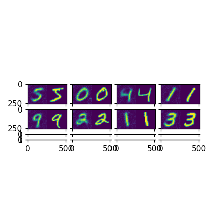

# 2D Variational Autoencoders
My favorite unsupervised modeling task. This experiment embeds 2D imagery in a compact latent space by modeling its principle components as a multivariate gaussian, a la [Kingma & Welling 2013](https://arxiv.org/abs/1312.6114).

## Flavors
Several derivatives VAE experiments are available in the separate yaml files.
- **mse.yaml** is the original experiment with Mean Square Error and [KLD](https://en.wikipedia.org/wiki/Kullback%E2%80%93Leibler_divergence) loss
- **fid.yaml** is identical to mse.yaml, but [FID(original, reconstruction)](https://en.wikipedia.org/wiki/Fr%C3%A9chet_inception_distance) is included in loss
- **adversarial.yaml** leverages adversarial regularization inspired by [Goodfellow 2014](https://arxiv.org/abs/1406.2661)

## Compatible Datasets
This experiment can be applied to the following datasets:
- [RSNA Intracranial Hemorrhage Prediction](https://www.kaggle.com/c/rsna-intracranial-hemorrhage-detection)
- [CQ500](http://headctstudy.qure.ai/dataset)
- [DeepLesion](https://www.nih.gov/news-events/news-releases/
- [torchvision datasets](https://pytorch.org/docs/stable/torchvision/datasets.html)

## Results
Reconstruction is on the left, original is on the right.
### MNIST
