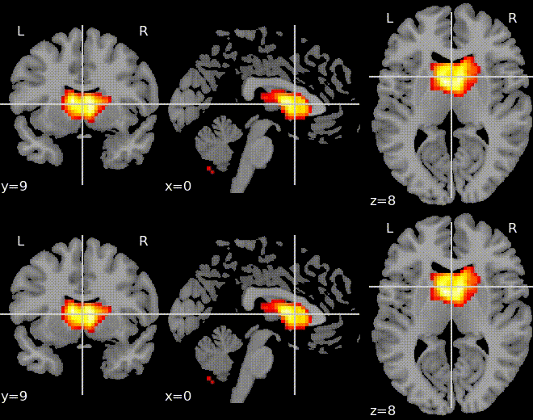

# 4D Variational Autoencoders
Functional magnetic resonance imaging (fMRI) data is nontrivial to handle due to its very high dimensionsality. Additionally, there are only few ways to interpret model performance. It is customary to visualize 4D data as animated 3D data.

## Flavors
Several derivatives VAE experiments are available in the separate yaml files:
- **mse.yaml** is the original experiment with Mean Square Error and [KLD](https://en.wikipedia.org/wiki/Kullback%E2%80%93Leibler_divergence) loss
- **adversarial.yaml** leverages adversarial regularization inspired by [Goodfellow 2014](https://arxiv.org/abs/1406.2661)

## Compatible Datasets
This experiment can be applied to the following datasets:
- [TReNDS Neuroimaging](https://www.kaggle.com/c/trends-assessment-prediction/)
