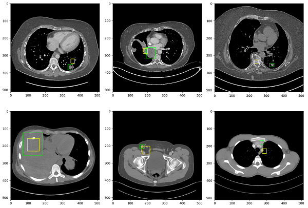

These experiments utilize the [DeepLesion](https://nihcc.app.box.com/v/DeepLesion) dataset released by the [National Institute of Health](https://www.nih.gov/news-events/news-releases/nih-clinical-center-releases-dataset-32000-ct-images) in 2018. The modeling task entails detecting and localizing visible lesions.

## Initial Attempt
My first effort entailed modeling the location of lesions directly:

```python
class MyLocalizationModel(nn.Module):
    ...

    def forward(self, input: Tensor) -> Tensor:
        # The model directly predicts the minX/maxX
        # and minY/maxY of the lesion
        bbox = self.predict(input)        
        return bbox
```

After a few days of training, the model showed some evidence of convergence (prediction is yellow, ground truth is green):



The model also appears to be making mistakes characteristic of a non-expert by inaccurately localizing the lesion to any "lesion-like" blob, such as a cross section of intestine or aorta. Instances where the model fails to localize to anything remotely lesion-like (top left tile) suggest those examples are on their way towards overfitting.

Because of the reasonably large image size (512x512), small batch sizes were required. In such situations, it is unclear if batch normalization is beneficial. A hyperparameter search was carried out to determine the effect of batch norm and an ideal learning rate, which indicated 

TODO: insert hparam result

## Multivariate Guassian
To add sophistication, the next iteration attempts to model the lesion's bounding box as a multivariate gaussian. Concretely, this means that instead of the model directly predicting the class labels, it predicts mean and standard deviation parameters that are then used to sample a normal distribution. This is also known as the *reparametrization trick*, and its use in was heavily inspired by [Kingma & Welling 2013](https://arxiv.org/abs/1312.6114). Unlike with variational autoencoders - which use a log normal distribution - this implementation uses the classic normal distribution:

```python
from torch.distributions import Normal

def reparameterize_normal(mu: Tensor, std_dev: Tensor) -> Tensor:
    return Normal(mu, std_dev).rsample(mu.shape)

class MyLocalizationModel(nn.Module):
    ...

    def forward(self, input: Tensor) -> Tensor:
        # The model predicts parameters of the distribution
        mu, std_dev = self.predict(input)

        # Sample from the normal distribution to produce the
        # final bounding box estimate.
        bbox = reparameterize_normal(mu, std_dev)
        
        return bbox
```

The hope was that the model would capture information about lesion margins, with overfitting occuring as the standard deviation approaches zero. Because all units are normalized to [0, 1], sigmoidal activation was used for all output activation layers. This permits the introduction of another hyperparameter, `kappa`, that scales the normalized standard deviation to a more appropriate range:

```python
class MyLocalizationModel(nn.Module):
    ...

    def forward(self, input: Tensor, kappa: float) -> Tensor:
        mu, std_dev = self.predict(input)

        # Scale the standard deviation from [0, 1] to [0, kappa]
        # where kappa is typically a very small value (e.g. 0.05)
        std_dev *= kappa

        bbox = reparameterize_normal(mu, std_dev)
        
        return bbox
```

This effectively limits the influence of the distribution and favors the central value with lower values of `kappa`.

## TODO
- Improve visualization