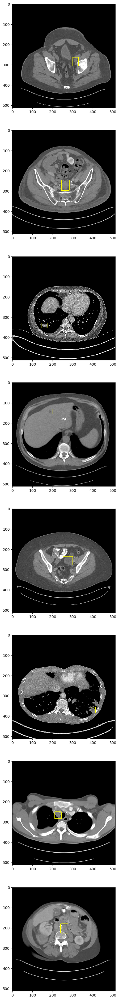

These experiments utilize the [DeepLesion](https://nihcc.app.box.com/v/DeepLesion) dataset released by the [National Institute of Health](https://www.nih.gov/news-events/news-releases/nih-clinical-center-releases-dataset-32000-ct-images) in 2018. The modeling task entails detecting and localizing visible lesions.

## Initial Attempt
My first effort entailed modeling the probability of a lesion being present and the lesion's bounding box as a multivariate  gaussian. Concretely, this means that instead of the model directly predicting the class labels, it predicts mean and variance parameters that are then used to sample a normal distribution. This is also known as the *reparametrization trick*, and its use in was heavily inspired by [Kingma & Welling 2013](https://arxiv.org/abs/1312.6114).

```python
def reparameterize(mu: Tensor, logvar: Tensor) -> Tensor:
    std = torch.exp(0.5 * logvar)
    eps = torch.randn_like(std)
    return eps * std + mu

class MyLocalizationModel(nn.Module):
    ...

    def forward(self, input: Tensor) -> Tensor:
        # `labels` predicts the probability of lesion presence.
        # When lesion is present, `mu` and `log_var` are the
        # predicted parameters for the normal distribution
        # describing the bounding box.
        labels, mu, log_var = self.predict(input)

        # Sample from the normal distribution to produce the
        # final bounding box estimate.
        bbox = reparameterize(mu, log_var)
        
        return labels, bbox
```

Note that the prediction for class label (lesion present vs. absent) is inferred directly, without involvement of the normal distribution. Bounding box coordinates only contribute to loss when a lesion is present.

## Results
The picture below is a placeholder that visualizes where lesions are on the image. A model will soon be trained to predict these coordinates, which will then be overlayed in a different color.



(TODO: insert picture of training dynamics)

## TODO
- Improve visualization