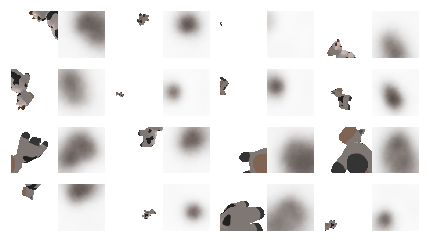

# Neural Rendering
This directory houses experiments on neural rendering, which bypasses rasterization and renders pixels in screen space directly from model input. The arbitrarily complex relationship between inputs and outputs permits sophisticated modeling of the underlying data.

## The Basics
The most basic neural rendering experiment attempts to reproduce the pixels drawn by a standard rasterization- based renderer according to a bounded transform.

In this first experiment, the model is given a 4x4 transformation matrix as input, and is tasked with rendering the mesh with no further variation. For simplicity's sake, [mean squared error (MSE)](https://en.wikipedia.org/wiki/Mean_squared_error) was used to calculate reconstruction loss.

Target image is on the left, model output is on the right.

Unsurprisingly, use of MSE without a progressive growing strategy yields only blurry messes.

TODO: implement progressive growing
TODO: implement FID loss