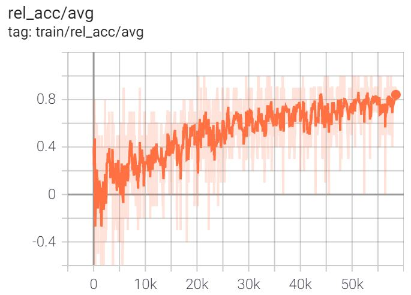
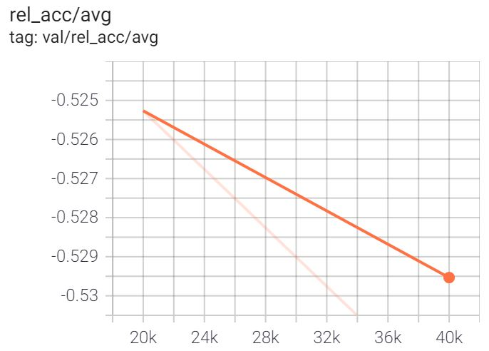

# Grasp-and-Lift EEG Detection (work in progress)
These experiments utilize the dataset from [Luciw et al 2014](https://www.nature.com/articles/sdata201447). The subjects wear a 32-channel EEG and perform a task involving grasping and lifting an object ([video 1](https://grasplifteeg.nyc3.digitaloceanspaces.com/41597_2014_BFsdata201447_MOESM69_ESM.avi), [video 2](https://grasplifteeg.nyc3.digitaloceanspaces.com/41597_2014_BFsdata201447_MOESM70_ESM.avi)). The model is trained to classify the last observed sample according to its associated part of the motor task. That is, the model is fed EEG data "as it is made", and can therefore be used in real time. Each of the twelve participants performed eight trials.

(TODO: insert picture of example data)

There are three ways to approach this supervised experiment: by splitting train/test examples randomly, by splitting the subjects into train/test groups, and by splitting the trials into train/test groups. EEG is notorious for its sensitivity to electrode placement, making generalization across subjects (and even trials) nontrivial. The classification task was easily solved when training on a random split, but failed to show any degree generalization when trained on a split of subjects or trials - as indicated by strictly decreasing validation accuracy. This outcome reflects disparate levels of difficulty for each aforementioned method.

Further work is warranted to determine if the trial split can be solved with popular methods. However, spending hundreds of dollars on GPU rentals to achieve these negative results has encouraged me to move on to different problems.

## Results
Regardless of the split method, training accuracy increases logarithmically. Near-100% training accuracy is achievable after a couple weeks. Random split training achieves high validation accuracy, but other methods fail to do so. 

The following depicts >80% relative accuracy achieved within a day of training - a trend observed with all splitting methods:

However, for the subject and trial splits, the validation accuracy (measured here at steps 20k and 40k) is strictly decreasing:

These trends reflect immediate overfitting on the training data.

### Relative Accuracy
Because >97% of all the dataset's samples are not associated with any class label, the model's overall accuracy does not intuitively reflect how well it performs above baseline performance. The model quickly learns the optimal strategy of outputting mostly zeros - achieving accuracy over 97% - then slowly learns to selectively predict class labels based on features of the input data. Normalizing accuracy above the baseline to [0, 1] in a quantity termed *relative accuracy* elegantly represents model performance after it learns the approximate frequencies of the labels.

**TODO**: show training dynamics
