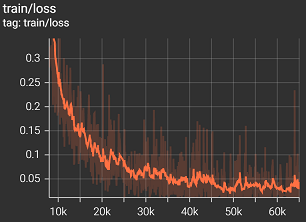

# Grasp-and-Lift EEG Detection
These experiments utilize the dataset from [Luciw et al 2014](https://www.nature.com/articles/sdata201447). The subjects wore a 32-channel, 500 Hz EEG cap and performed a task involving grasping and lifting an object ([video 1](https://grasplifteeg.nyc3.digitaloceanspaces.com/41597_2014_BFsdata201447_MOESM69_ESM.avi), [video 2](https://grasplifteeg.nyc3.digitaloceanspaces.com/41597_2014_BFsdata201447_MOESM70_ESM.avi)). The model is trained to classify the last observed sample according to its associated part of the motor task. That is, the model is fed EEG data "as it is made", and can therefore be used in real time. Each of the twelve participants performed eight trials.

> 
Note: only 8 of the 24 channels are depicted here.

## Results
The classification task was solved (>99% accuracy) across a split of subjects with clear evidence of generalization. A model was trained on eight subjects and generalized almost perfectly to three novel subjects. In other words, the best possible outcome was achieved. Validation accuracy observed stable dynamics and efficient convergence:

>   
***Validation accuracy by step. Converges to >99% at roughly 60,000 steps.***

For reference, here is the training accuracy and loss, respectively:

>   
***Training accuracy by step, with aggressive smoothing applied.***

>   
***Training loss by step, with aggressive smoothing applied.***

This performance was achieved by training a 4.4 million parameter ResNet-style architecture for about three hours on a single 1080 Ti.

## Discussion
### Balanced Labels
Generalization across subjects could only be achieved after balancing each minibatch's distribution of labels. With unbalanced labels, the network would converge to ~99% accuracy very quickly, making it necessary to compute a *relative accuracy* metric that normalizes performance above baseline accuracy. This presented issues with precision, as the optimizer would be forced to work on numbers within a very small range - differences of <2% accuracy in this case. There were issues with optimization more broadly, as batches often lacked labeled examples entirely. ResNet's extensive use of batch normalization is reported to perform poorly with unbalanced labels, so the balancing appears critical to this experiment's success.

## Materials & Methods
There are three ways to approach this supervised experiment: by splitting train/test examples randomly, by splitting the subjects into train/test groups, and by splitting the trials into train/test groups. EEG is notorious for its sensitivity to electrode placement, making generalization across subjects (and even trials) nontrivial. Each method was investigated.

### Random Split
Randomly assigning examples from the dataset to be withheld for validation is the simplest and least sophisticated way to create a training split. It has the distinct advantage of ensuring the validation examples are substantially similar (but not identical) to training examples. This reliably induces overfitting, which can be leveraged in the early stages of an experiment to ensure a working implementation. The following training dynamics serve as evidence that various aspects of the experiment function as expected:

>   
***Optimizing vanishingly small differences in accuracy yields similarly noisy dynamics, characteristic of a floating point precision bottleneck.***

### Subject/Series Split
The holy grail of this EEG classification task is the ability to generalize across novel subjects. Though this was one of the first medical AI projects I started working on, such results proved elusive for nearly a year. Most of time, training accuracy would improve (as shown above) but validation performance would decrease over time:

>   
***One of this experiment's most common failure modes: unexpected worsening of validation performance with more training. This image was sourced from an early run, before label balancing was added.***

Determining whether this was due to the data - i.e. training/validation data being too different - or my own code wasn't straightforward. The solution of balancing labels occured to me when I inquired about the practice in my professional work. Now every experiment of mine uses label balancing by default.

### Future Direction
This experiment was a massive success and `GraspAndLiftEEGDetection` has since become a "stock" dataset for me. Because my familiarity with it is so high, I find it ideal for multi-dataset experiments. I fully intend to use the trained model from this experiment in future projects.

Right now my goal is to contribute this dataset to [Lightning Bolts](https://github.com/PyTorchLightning/lightning-bolts/pull/742). While the authors [greenlit its inclusion in late 2020](https://github.com/PyTorchLightning/lightning-bolts/pull/446), I opted to hold off until I could confirm cross-subject generalization was feasible.

### Experiment Files
| File                                                                         | Input Size (CxW) | Sample Rate | Notes
| ---------------------------------------------------------------------------- | ---------------- | ----------- | -----
| [classification/basic.yaml](classification/basic.yaml)                       | 32x2048          | 500 Hz      | "Vanilla" experiment setup (performs poorly)
| [classification/basic_hparams.yaml](classification/basic_hparams.yaml)       | 32x2048          | 500 Hz      | Hyperparameter search for `basic.yaml`
| [classification/halfres.yaml](classification/halfres.yaml)                   | 32x1024          | 250 Hz      | Half-resolution input
| [classification/halfres_hparams.yaml](classification/basic_hparams.yaml)     | 32x1024          | 250 Hz      | Hyperparameter search for `halfres.yaml`
| [classification/balanced.yaml](classification/balanced.yaml)                 | 32x1024          | 250 Hz      | Minibatches have equal label distribution (performs well)
| [classification/balanced_hparams.yaml](classification/balanced_hparams.yaml) | 32x1024          | 250 Hz      | Hyperparameter search for `balanced.yaml`

### Source Files
| File                                                                     | Notes
| ------------------------------------------------------------------------ | ----- 
| [src/classification.py](/src/classification.py)                          | Base classification experiment
| [src/dataset/grasp_and_lift_eeg.py](/src/dataset/grasp_and_lift_eeg.py)  | Grasp-and-Lift EEG dataset
| [src/models/resnet_classifier1d.py](/src/models/resnet_classifier1d.py)  | 1D ResNet classifier model

## License
### Data
EEG data is released under [Attribution 4.0 International Creative Commons License](https://creativecommons.org/licenses/by/4.0/).

### Code
Apache 2.0 / MIT dual-license. Please contact me if this is somehow not permissive enough and we'll add whatever free license is necessary for your project.

