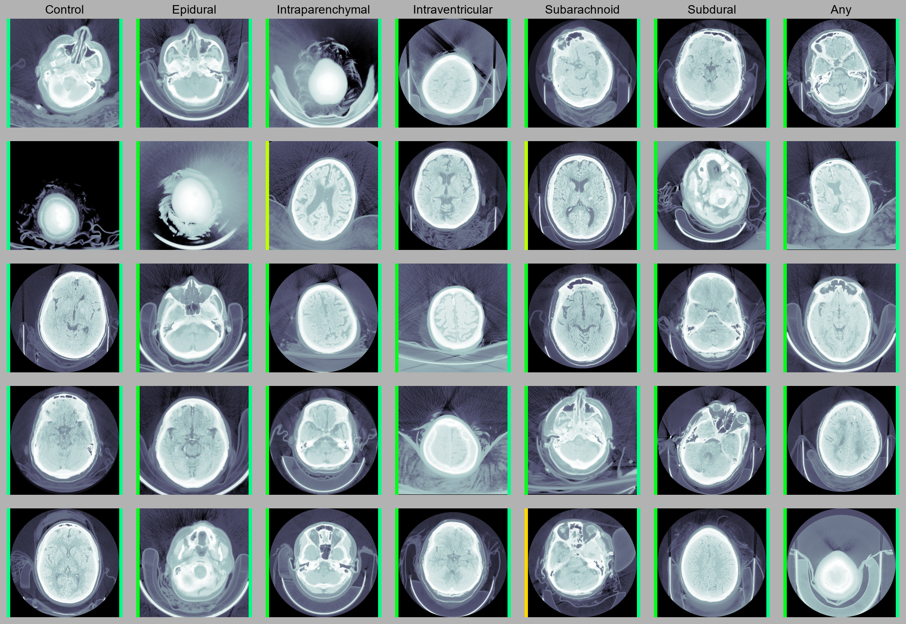

These experiments utilize the [RSNA Intracranial Hemorrhage Detection](https://www.kaggle.com/c/rsna-intracranial-hemorrhage-detection) dataset released by the [Radiological Society of North America](https://www.rsna.org/).

## Results

The left indicator bar represents per-class accuracy and the right represents accuracy across all classes. Visualizing these metrics separately helps gauge performance on a per-class basis. Low (baseline) performance is mapped to red, and 100% accuracy is signified with bright green.

Columns include examples with at least the designated class label, and may have more labels (meaning some examples could have been displayed in multiple columns). This was done because some classes of hemorrhage do not occur isolation within the dataset. Concretely, the "Epidural" column includes any examples positive for epidural hemhorrage, some of which are also positive for intraparenchymal, subarachnoid, etc. The "Control" column features exclusively healthy subjects. 

TODO: show training dynamics

