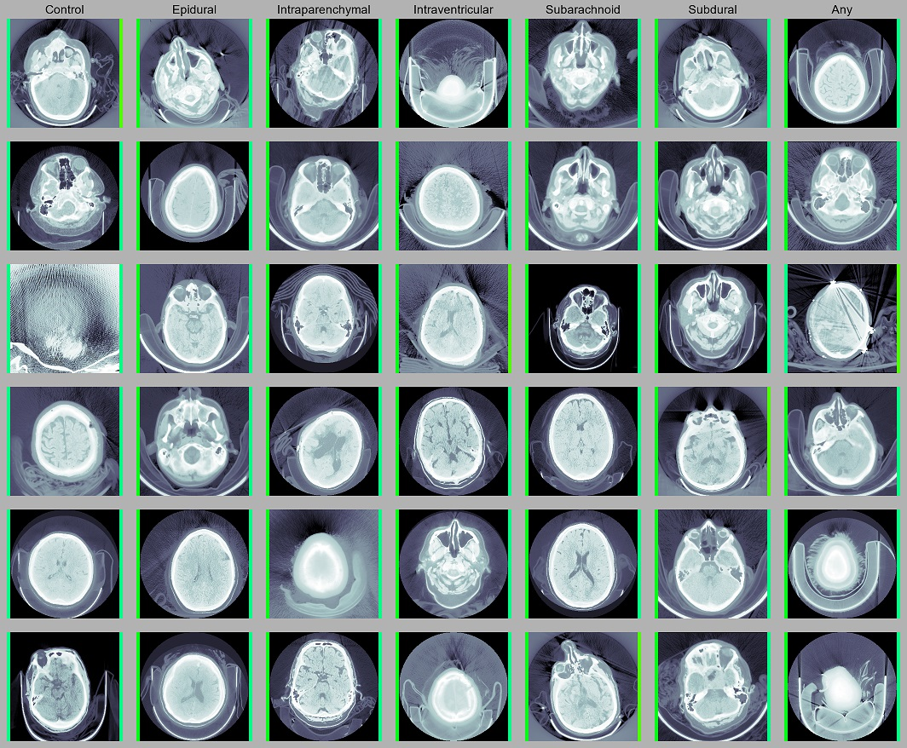
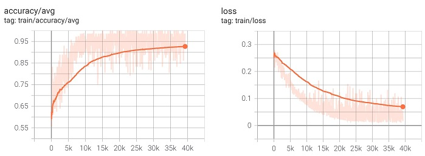
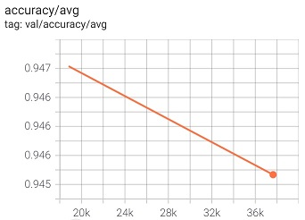

# RSNA Intracranial Hemorrhage Detection

These experiments utilize the [RSNA Intracranial Hemorrhage Detection](https://www.kaggle.com/c/rsna-intracranial-hemorrhage-detection) dataset released by the [Radiological Society of North America](https://www.rsna.org/) in 2019. It proposes a relatively simple task where one or more classes of ICH are assigned to individual CT slices. 

## Results
~95% validation accuracy was achieved with <12 hours of training on a single 1080 Ti.

Columns include examples with at least the designated class label, and may have more labels (meaning some examples could have been displayed in multiple columns). This was done because some classes of hemorrhage do not occur in isolation within the dataset. Concretely, the "Epidural" column includes any examples positive for epidural hemhorrage, some of which are also positive for intraparenchymal, subarachnoid, etc. The "Control" column features exclusively healthy subjects.

The left indicator bar represents per-class accuracy and the right represents accuracy across all classes. Visualizing these metrics separately helps gauge performance on a per-class basis. Low (baseline) performance is mapped to red, and 100% accuracy is signified in bright green.

Because model accuracy is high, all indicators bars are green. However, the `Control` column's per-class indicators are all a perceivably lighter shade of green than those of other columns, suggesting the model is biased in favor of [type 1 error](https://en.wikipedia.org/wiki/Type_I_and_type_II_errors). This is considered desirable for such medical technology because *type 2 errors* - false negative - are far more likely to be fatal; human attention should *always* be directed at edge cases.

## Materials & Methods
### Training Dynamics
Stable training dynamics were exhibited with the [mean-squared error](https://en.wikipedia.org/wiki/Mean_squared_error) loss function, which likely only worked so well because of the dataset's relatively even distribution of class labels.

Training beyond one epoch did not increase validation accuracy. Optimal performance was achieved around step 19,000 - prior to the end of the first epoch - suggesting further training at this learning rate results in overfitting.

Because such high validation accuracy was observed so early into training, it is possible that the validation set is composed of categorically easier examples. It is difficult to make this qualitative judgment without the ability to interpret CTs.

### Half-Resolution Training
The weights from any fully convolutional network are able to be applied to images of arbitrary dimensions - even dimensions differing from those with which it was trained. While larger convolutional kernel sizes are able to more easily capture large-scale details, they come with a significant increase in compute overhead. For simplicity, my portfolio uses the 3x3 and 1x1 kernels exclusively, and other aspects of the experiment (model architecture, input resolution, etc.) are optimized against this small kernel size.

Training at half the input resolution (256x256) can be seen as analagous to doubling the dimensions of the kernel (up to 6x6) and enabling the model to more easily capture detail at those larger scales. Reduced memory overhead and larger batch sizes can be appreciated with this single change, leading to dramatically higher training performance.

### Experiment Files
| File                                                                     | Input Resolution | Notes
| ------------------------------------------------------------------------ | ---------------- | ------
| [classification/basic.yaml](classification/basic.yaml)                   | 512x512          | "Vanilla" experiment setup
| [classification/basic_hparams.yaml](classification/basic_hparams.yaml)   | 512x512          | Hyperparameter search for `basic.yaml`
| [classification/halfres.yaml](classification/halfres.yaml)               | 256x256          | Half-resolution input slices
| [classification/halfres_hparams.yaml](classification/basic_hparams.yaml) | 256x256          | Hyperparameter search for `halfres.yaml`
